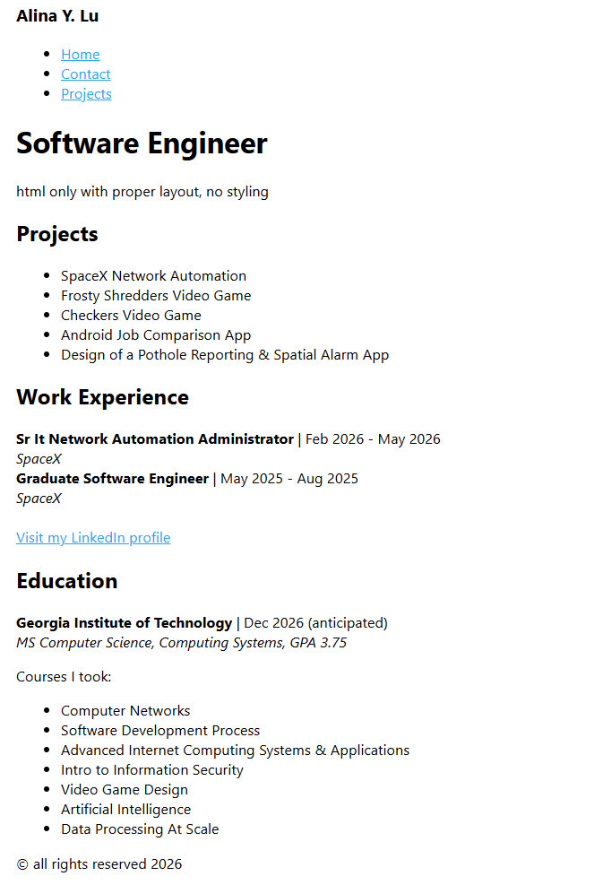
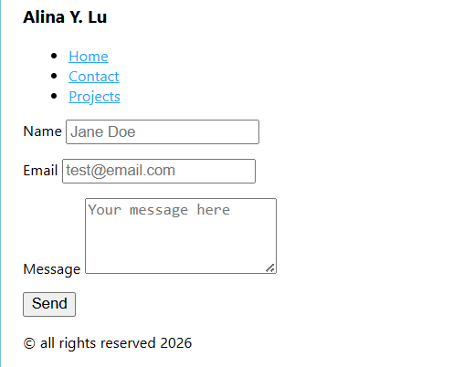

# Front End Projects from Roadmap.sh

This repository contains front-end projects built following the [roadmap.sh](https://roadmap.sh) front-end developer path.

## Roadmap Project Instructions
[01 Single Page CV](https://roadmap.sh/projects/single-page-cv) 
[02 Basic Html Website](https://roadmap.sh/projects/basic-html-website)

## My Project - Live Demo Links
Click any of the images below to view the live demo of the project.

	01 Single Page CV 
	

	02 Basic Html Website 
	

